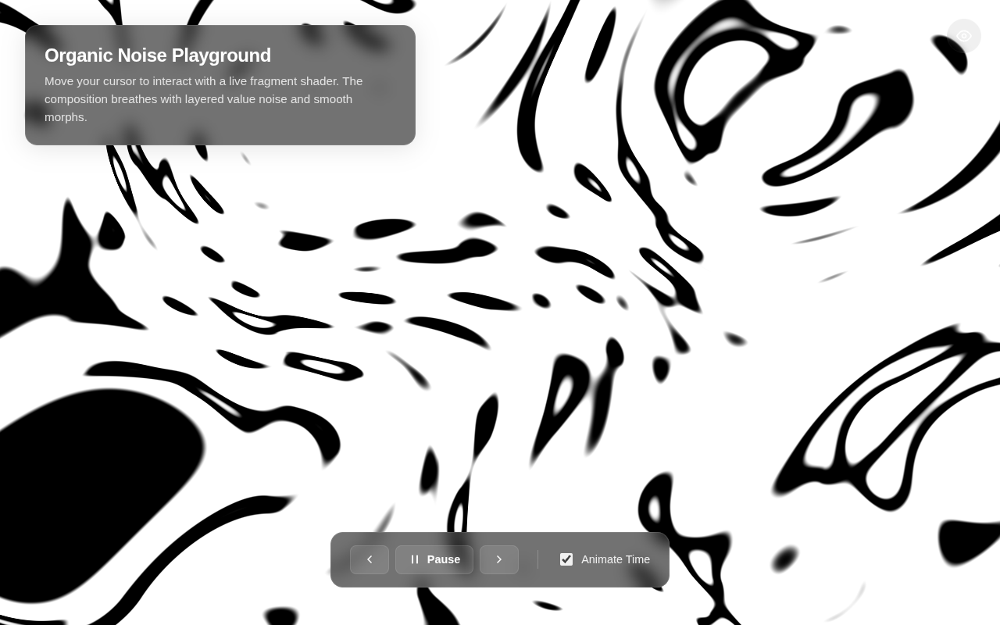

# Interactive GLSL Gallery

A single-file WebGL gallery of fragment shaders ("Organic Noise Playground" and friends) with prev/next navigation, pause/resume, and mouse + click interaction.

**Live:** https://mvvk-space.github.io/ai-studio-code/

